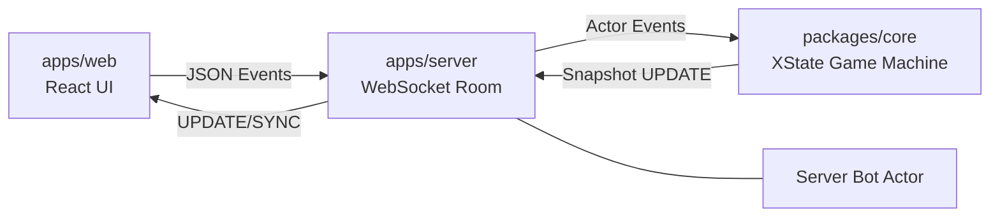

# Step13 시스템 아키텍처 (System Architecture)

## 1. 개요 (Overview)

이 프로젝트는 세 가지 런타임 레이어를 가진 Turborepo 모노레포입니다:

- `apps/web`: React 클라이언트 (UI, 로컬 상호작용, 웹소켓 전송)
- `apps/server`: Fastify + WebSocket 게이트웨이 (방/세션 오케스트레이션, 봇 호스팅)
- `packages/core`: 결정론적 게임 엔진 상태 머신 (권위 있는 규칙 전이)

지원 패키지:

- `packages/proto`: 공유 런타임 타입/계약(contracts)
- `packages/scoring`: 샹텐/점수 계산
- `packages/bot` (Future): AI 봇 로직 및 전략 (현재 초기 단계)
- `packages/assets` (Future): 게임 에셋 관리 (현재 초기 단계)

## 2. 런타임 토폴로지 (Runtime Topology)

## 3. 코어 엔진 설계 (리팩토링됨)

`packages/core`는 이제 **상태 오케스트레이션**과 **규칙 실행**을 분리합니다:

- 오케스트레이션: `packages/core/src/machine.ts`
  - 상태 그래프, 페이즈 전이, 타이머, 이벤트 라우팅 소유
- 규칙 실행 정책: `packages/core/src/engine/defaultEngine.ts`
  - 딜러 선정 (주사위 + 동점자 처리)
  - 배패/벽 생성
  - 도라 선택/자동 선택
  - 패 검증 및 텐파이 자동 완성 폴백
  - 타패 적용
  - 유국/론 해결
  - 룰셋 팩토리 `packages/core/src/engine/rulesets.ts`를 통해 선택 가능

이는 취약한 머신 내 분기를 줄이고 머신 그래프를 재작성하지 않고도 규칙 동작을 교체할 수 있게 합니다.

`createGameMachine({ ruleset })`이 노출되어 각 런타임이 머신 소스를 변경하지 않고 룰셋을 선택할 수 있습니다.

## 4. 페이즈 파이프라인 (Phase Pipeline)

라운드 레벨 파이프라인은 명시적입니다:

1. `matchStart`
2. `doraSelect`
3. `handBuild`
4. `gameLoop.turn/checkRon`
5. `roundEnd`
6. (`matchStart` 다음 핸드) 또는 `matchEnd`

페이즈별 머신 책임:

- 페이즈 진입/이탈 타이밍
- 전이 가드(guard)
- 엔진 정책으로의 이벤트 디스패치

페이즈별 엔진 책임:

- 페이즈별 연산 및 컨텍스트 패치 생성

## 5. 상태 소유권 (State Ownership)

권위 있는 상태 필드는 `GameContext` (`packages/core/src/messages.ts`)에 있습니다:

- 플레이어/세션: `players`, `dealer`, `dealerDice`, `seatMap`
- 라운드 설정: `dealtTiles`, `wall`, `doraIndicators`
- 플레이 진행: `hands`, `pools`, `discards`, `lastDiscard`, `currentTurn`
- 결과: `winner`, `winResult`, `scores`
- 관측성: `eventLog`

## 6. 이벤트 모델 (Event Model)

입력 이벤트는 명령어 형태입니다 (`JOIN`, `START_MATCH`, `SELECT_DORA`, `SUBMIT_HAND`, `DISCARD`, `DECLARE_WIN`, `RESTART`).

출력 효과(effects)는 컨텍스트 업데이트 + 로그 이벤트를 통해 표현됩니다 (`TIMEOUT`, `ROUND_END`, `MATCH_END`, `AUTO_RON`).

리플레이 시스템 (`replayMachine`)은 결정론적 재생을 위해 `eventLog`를 스냅샷으로 리플레이합니다.

## 7. 리셋/복구 동작 (Reset/Recovery Behavior)

`RESTART`는 머신에서 전역적으로 처리되며 어떤 페이즈에서든 `idle`로 리셋됩니다.

서버 웹소켓 바인딩은 리셋 후 동일한 `playerId`에 대해 동일한 소켓에서 재-`JOIN`을 허용하여 로비 상태가 고착되는 것을 방지합니다.

## 8. 확장성 전략 (Extensibility Strategy)

미래의 변형을 위해, 새로운 동작은 먼저 엔진 정책 내부에 유지하십시오:

- 대체 딜러 정책
- 대체 도라/오프닝 정책
- 대체 타임아웃 정책
- 대체 승리 임계값/점수 정책

페이즈 구조 자체가 변경될 때만 머신 전이를 수정하십시오.

현재 서버 런타임 연결: `apps/server/src/index.ts`는 `RULESET` 환경 변수를 읽고 해당 룰셋으로 `GameRoom`을 초기화합니다.
