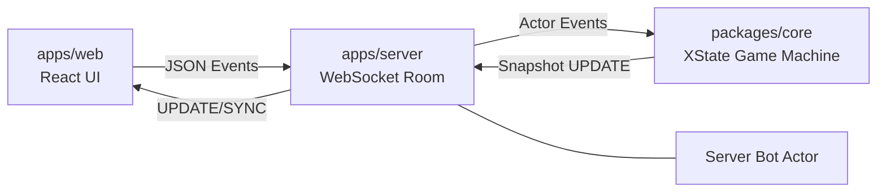

# Step13 System Architecture

## 1. Overview

This project is a Turborepo monorepo with three runtime layers:

- `apps/web`: React client (UI, local interaction, websocket transport)
- `apps/server`: Fastify + WebSocket gateway (room/session orchestration, bot hosting)
- `packages/core`: deterministic game engine state machine (authoritative rule transitions)

Supporting packages:

- `packages/proto`: shared runtime types/contracts
- `packages/scoring`: shanten/score calculation

## 2. Runtime Topology

## 3. Core Engine Design (Refactored)

`packages/core` now separates **state orchestration** and **rule execution**:

- Orchestration: `packages/core/src/machine.ts`
  - owns state graph, phase transitions, timers, event routing
- Rule execution policies: `packages/core/src/engine/defaultEngine.ts`
  - dealer selection (dice + tie-break)
  - deal/wall creation
  - dora selection/auto-selection
  - hand validation & tenpai auto-build fallback
  - discard application
  - draw/ron resolution
  - selectable via ruleset factory `packages/core/src/engine/rulesets.ts`

This reduces brittle in-machine branching and enables swapping rule behavior without rewriting the machine graph.

`createGameMachine({ ruleset })` is exposed so each runtime can choose a ruleset without changing machine source.

## 4. Phase Pipeline

Round-level pipeline is explicit:

1. `matchStart`
2. `doraSelect`
3. `handBuild`
4. `gameLoop.turn/checkRon`
5. `roundEnd`
6. (`matchStart` next hand) or `matchEnd`

Machine responsibilities per phase:

- phase enter/exit timing
- transition guards
- event dispatch to engine policies

Engine responsibilities per phase:

- phase-specific computation and context patch production

## 5. State Ownership

Authoritative state fields are in `GameContext` (`packages/core/src/messages.ts`):

- player/session: `players`, `dealer`, `dealerDice`, `seatMap`
- round setup: `dealtTiles`, `wall`, `doraIndicators`
- play progress: `hands`, `pools`, `discards`, `lastDiscard`, `currentTurn`
- outcomes: `winner`, `winResult`, `scores`
- observability: `eventLog`

## 6. Event Model

Input events are command-like (`JOIN`, `START_MATCH`, `SELECT_DORA`, `SUBMIT_HAND`, `DISCARD`, `DECLARE_WIN`, `RESTART`).

Output effects are represented through context updates + log events (`TIMEOUT`, `ROUND_END`, `MATCH_END`, `AUTO_RON`).

Replay system (`replayMachine`) replays event logs into snapshots for deterministic playback.

## 7. Reset/Recovery Behavior

`RESTART` is handled globally in the machine and resets to `idle` from any phase.

Server websocket binding permits re-`JOIN` on the same socket for the same `playerId` after reset, preventing stuck lobby state.

## 8. Extensibility Strategy

For future variants, keep new behavior inside engine policies first:

- alternate dealer policy
- alternate dora/opening policy
- alternate timeout policy
- alternate win threshold/scoring policy

Only modify machine transitions when phase structure itself changes.

Current server runtime wiring: `apps/server/src/index.ts` reads `RULESET` env and initializes `GameRoom` with that ruleset.
