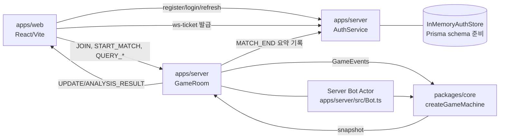

# Step13 시스템 아키텍처 (System Architecture)

기준일: `2026-02-20`

## 1. 모노레포 구성

| 경로 | 책임 | 상태 |
|---|---|---|
| `apps/web` | React UI, WebSocket 클라이언트, 조패/리플레이/미니게임 화면 | 운영 중 |
| `apps/server` | Fastify + WS 게이트웨이, 룸 오케스트레이션, 봇 연결 | 운영 중 |
| `packages/core` | XState 게임 상태머신 + 규칙 엔진 인터페이스 | 운영 중 |
| `packages/proto` | 공유 타입(`Tile`, `GamePhase`, `PlayerId` 등) | 운영 중 |
| `packages/scoring` | 샹텐/우케이레/점수 계산 | 운영 중 |
| `packages/bot` | 봇 조패/버림패 로직 + 페르소나 프로필 | 운영 중 |
| `packages/assets` | 에셋 패키지 자리(placeholder) | 초기 |

## 2. 런타임 토폴로지

핵심 원칙:

- 서버 권위(Server Authoritative): 상태 전이는 `packages/core` 머신이 결정
- 클라이언트는 서버 스냅샷(`UPDATE`)을 렌더링
- `QUERY_ANALYSIS`는 룸에서 처리 후 `ANALYSIS_RESULT` 단방향 응답

## 3. Core 레이어

### 3.1 상태 오케스트레이션 vs 규칙 실행 분리

- 오케스트레이션: `packages/core/src/machine.ts`
  - 상태 전이, 타이머, 가드, 라운드 확정 게이트
- 규칙 실행: `packages/core/src/engine/defaultEngine.ts`
  - 딜/선결정, 도라 선택, 조패 검증, 타패 적용, 론/유국 판정
- 룰셋 팩토리: `packages/core/src/engine/rulesets.ts`
  - 현재 `classic` 1종

### 3.2 권위 상태(`GameContext`) 소유권

정식 상태 소스: `packages/core/src/messages.ts`

주요 필드:

- 참여자/좌석: `players`, `dealer`, `seatMap`, `dealerDice`
- 라운드 리소스: `dealtTiles`, `wall`, `doraIndicators`
- 진행 상태: `hands`, `pools`, `discards`, `currentTurn`, `lastDiscard`
- 결과/점수: `winner`, `winResult`, `scores`
- 운영 메타: `eventLog`, `deterministicSeed`, `timeBankRemainingMs`, `roundEndConfirmedBy`

## 4. Server 레이어

중심 파일: `apps/server/src/GameRoom.ts`
인증 파일: `apps/server/src/auth/*`, `apps/server/src/index.ts`

책임:

- HTTP 인증/프로필/전적 API
  - `POST /auth/register`, `POST /auth/login`, `POST /auth/refresh`, `POST /auth/logout`
  - `POST /auth/ws-ticket`, `GET /me`, `PATCH /me/profile`, `GET /me/stats/summary`
- WS 핸드셰이크 전 티켓 검증(1회용, 짧은 TTL)
- 인증 사용자 -> 게임 `playerId(user:{userId})` 서버 강제 바인딩
- 소켓 바인딩 플레이어 검증(`JOIN` 선행, playerId 고정)
- 이벤트 전달 전 최소 검증(타인 playerId 위조 차단)
- `QUERY_ANALYSIS`, `QUERY_PERSONAS` 처리
- 봇 생명주기(`ADD_BOT`) 및 페르소나 정규화
- 상태 브로드캐스트 시 포그오브워 마스킹 적용
- `MATCH_END` 시 매치 요약 전적 저장

마스킹 정책(클라이언트별 sanitize):

- `wall`: 공개 도라만 노출, 나머지는 `wall-{idx}`
- 상대 `hands`/`pools`: `ROUND_END` 전까지 숨김
- 상대 `dealtTiles`: 항상 숨김
- `eventLog.START_MATCH.seed`, `context.deterministicSeed`: 숨김

## 5. Web 레이어

중심 파일: `apps/web/src/App.tsx`, `apps/web/src/hooks/useGameSocket.ts`

역할:

- 로그인/회원가입/토큰 갱신 게이트
- 프로필 편집(닉네임/소개) 및 전적 요약 UI
- 소켓 연결 전 `POST /auth/ws-ticket` 수행
- 메인 모드: 매치 모드 / 싱글 미니게임 모드
- `useGameSocket`에서 reconnect 시 `JOIN` 재바인딩 + pending 이벤트 재전송
- 분석 응답은 `queryId` 상관관계로 소비(오래된 응답 무시)
- 라운드 종료는 `CONFIRM_ROUND_END`를 사용자 확인 액션으로 전송
- 리플레이는 `context.eventLog`를 `replayMachine`으로 재생

## 6. 분석 질의 경로

- 요청: Web -> `QUERY_ANALYSIS`
- 처리: `GameRoom.handleAnalysisQuery`
- 계산: `@step13/scoring` 직접 계산 + 임시 Bot 로직 호출
- 응답: `ANALYSIS_RESULT { queryId, ... }`

`queryId`는 반드시 클라이언트에서 발급/매칭해야 하며, UI는 요청-응답 1:1로 소비한다.

## 6.5 인증 세션 경로

1. 사용자가 로그인/회원가입 (`/auth/login` 또는 `/auth/register`)
2. 서버가 `accessToken + refreshToken` 발급
3. 웹은 WS 연결 직전 `/auth/ws-ticket` 호출
4. `/ws?ticket=...`로 연결, 서버는 티켓 1회 소비 후 사용자 바인딩
5. WS 이벤트는 사용자 바인딩 기준으로 `playerId`를 서버가 강제

## 7. 테스트 아키텍처

- 단위 테스트
  - `packages/core/src/*.test.ts`
  - `packages/scoring/src/points.test.ts`
  - `packages/bot/src/*.test.ts`
- 통합/시나리오
  - `scripts/test-e2e-flows.ts` (`pnpm test:e2e`)
- 시뮬레이션
  - `scripts/simulate-ai-vs-ai.ts` (`pnpm sim:ai`)

## 8. 아키텍처 변경 시 필수 문서

아래 코드 영역 변경 시 최소 동기화 문서:

- `packages/core/src/machine.ts`, `packages/core/src/rules.ts`
  - `docs/prd.yaml`, `docs/system-flow.md`
- `apps/server/src/GameRoom.ts`
  - `docs/system-architecture.md`, `docs/system-flow.md`
- `apps/web/src/hooks/useGameSocket.ts`, `apps/web/src/components/*`
  - `docs/system-flow.md`
- 전체 작업 방식
  - `docs/ai-doc-first-workflow.md`
