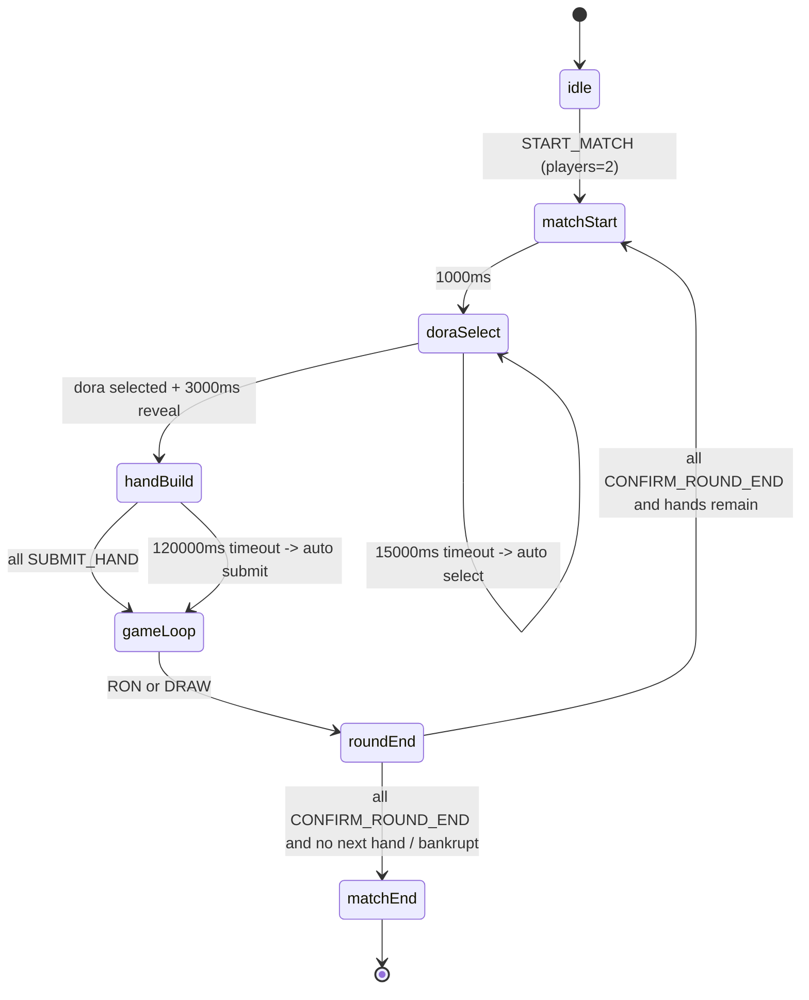
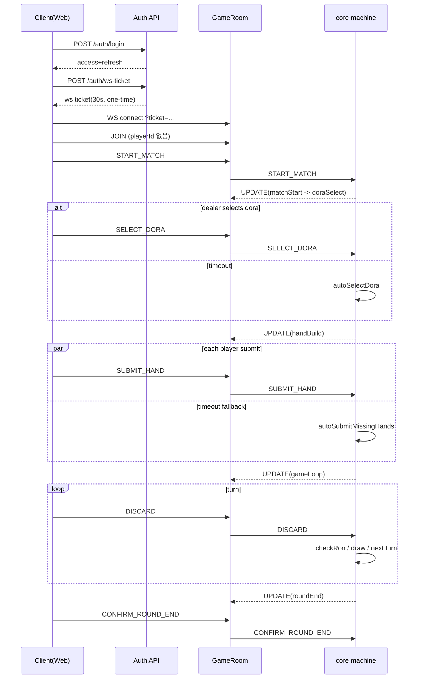

# Step13 시스템 흐름 (System Flow)

기준일: `2026-02-20`

## 1. 매치 수명주기

## 2. 상세 이벤트 시퀀스

## 3. 타이머 도메인 (실제 코드 값)

- `matchStart -> doraSelect`: `1000ms`
- `doraSelectTimeMs`: `15000ms`
- `doraRevealTimeMs`: `3000ms`
- `buildTimeMs`: `120000ms`
- `turnTimeMs`: `10000ms`
- `timeBankMs`: `3000ms`

턴 타임아웃 규칙:

1. `turnTimeMs` 만료
2. 현재 턴 플레이어 타임뱅크가 남아 있으면 `turnOvertime` 진입
3. `timeBankMs` 만료 시 강제 `DISCARD`

## 4. 라운드 종료 게이트

라운드는 즉시 다음 핸드로 넘어가지 않으며, `roundEndConfirmedBy`가 모든 플레이어에 대해 `true`가 되어야 전이한다.

- 사람 플레이어: `CONFIRM_ROUND_END` 필요
- 봇 플레이어: `roundEnd` 진입 시 자동 확인

전이 조건:

- 전원 확인 + 파산(`<= 0`) 발생 -> `matchEnd`
- 전원 확인 + 핸드 남음 -> `matchStart`
- 전원 확인 + 핸드 없음 -> `matchEnd`

## 5. 분석 질의(Query) 흐름

### 5.1 일반 분석

1. 웹이 `QUERY_ANALYSIS` 전송 (`queryId` 포함)
2. 서버가 질의 타입별 계산
3. 서버가 `ANALYSIS_RESULT` 응답 (`queryId` 그대로)
4. 웹은 현재 대기 중인 `queryId`와 일치할 때만 반영

주요 질의 타입:

- `SHANTEN`
- `SCORE`
- `SCORE_PREVIEW`
- `AI_HINT`
- `MINI_GAME_EVAL`

### 5.2 상관관계 키 규칙

- 요청마다 새 `queryId` 생성
- UI 상태는 `queryId` 매칭으로만 갱신
- 매칭 실패 응답은 반드시 무시

관련 코드:

- `apps/web/src/components/HandBuilder.tsx`
- `apps/web/src/components/SingleMiniGame.tsx`
- `apps/web/src/App.tsx`
- `apps/server/src/GameRoom.ts`

## 5.5 인증/토큰 갱신 흐름

1. access 만료 또는 401 수신
2. 웹이 `POST /auth/refresh` 호출
3. 서버가 refresh rotation 후 새 토큰 발급
4. 웹은 새 refresh를 저장하고 이후 요청/소켓 티켓 발급에 재사용

## 6. AI 대전 종료/재시작 흐름

`App.tsx`에서 AI 대전 중 종료 메뉴 제공:

- 로비로 이동: `RESTART` 전송 후 idle
- 조패부터 재시작: `RESTART` 후 자동 시퀀스
  - `JOIN` -> `ADD_BOT` -> `START_MATCH`

## 7. 리플레이 흐름

- 데이터 소스: `context.eventLog`
- 재생기: `packages/core/src/replayMachine.ts`
- 지연 전이(`after`)도 재생 시계로 선반영하여 상태를 재구성

웹 리플레이 화면:

- `apps/web/src/components/ReplayViewer.tsx`
- 현재 스냅샷 기준 위험패/대안 패를 계산해 가이드 오버레이 제공

## 8. 운영 리스크 체크포인트

- refresh token은 재사용 시 거부되어야 함(rotation)
- ws ticket은 단일 사용 + 짧은 TTL을 유지해야 함
- 비동기 질의 응답은 `queryId`로 반드시 상관관계 매칭
- `dealtTiles`/라운드 변경 시 UI 상태 초기화는 실제 데이터 시그니처 변화로만 수행
- 소켓/타이머 구독은 effect cleanup 보장
