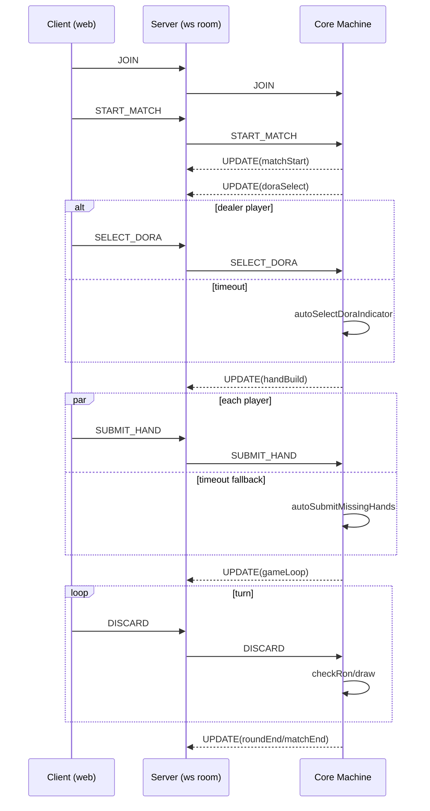
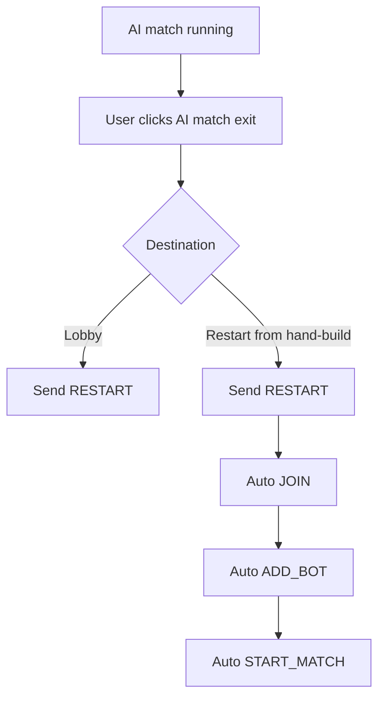

# Step13 System Flow

## 1. Session Flow

## 2. AI Match Exit Flow

## 3. Hand Build Scoring Preview Flow

1. client selects 13 tiles
2. waits are calculated from shanten (`-1` winning shape)
3. each wait tile is scored via `calculateScore(hand, waitTile, ..., doraIndicators, options)`
4. preview chooses best result by:
   - max `points`
   - tie-breaker: max `han`
5. UI renders
   - `(currentHan / minimumRequiredHan)`
   - point preview
   - wait tiles list

## 4. Timer Domains

- `doraSelectTimeMs`: dealer dora selection timeout
- `buildTimeMs`: hand build timeout
- `turnTimeMs`: per-turn countdown
- `timeBankMs`: per-player turn reserve

Timers are phase-scoped in the machine. Entering/leaving phase rebinds timer behavior.

## 5. Observability

Primary trace sources:

- `context.eventLog` in core snapshots
- server console telemetry (`START_MATCH`, `SUBMIT_HAND`, `DISCARD`, `AUTO_RON`, `ROUND_END`, `GUIDE_VIEW`)
- websocket UPDATE payloads in web console

For debugging, reproduce by replaying `eventLog` via `replayMachine`.
