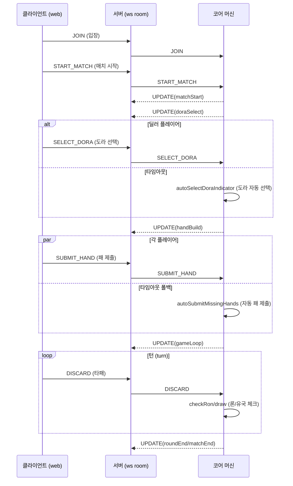
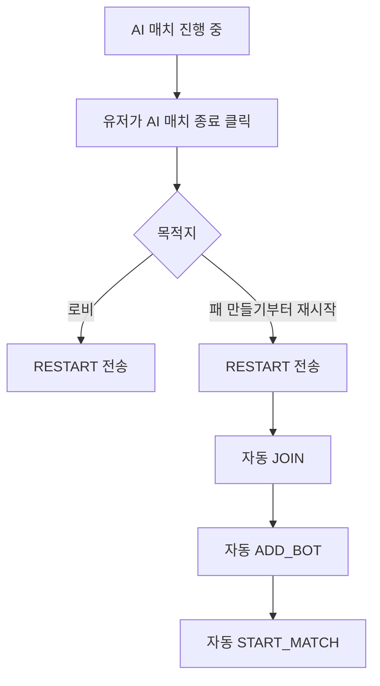

# Step13 시스템 흐름 (System Flow)

## 1. 세션 흐름 (Session Flow)

## 2. AI 매치 종료 흐름 (AI Match Exit Flow)

## 3. 패 만들기 점수 미리보기 흐름 (Hand Build Scoring Preview Flow)

1. 클라이언트가 13장의 패를 선택합니다.
2. 샹텐(shanten) 계산을 통해 대기패(waits)를 계산합니다 (`-1`은 완성 형태).
3. 각 대기패는 `calculateScore(hand, waitTile, ..., doraIndicators, options)`를 통해 점수가 계산됩니다.
4. 미리보기는 다음 기준으로 최적의 결과를 선택합니다:
   - 최대 `points` (점수)
   - 동점 시: 최대 `han` (판수)
5. UI 렌더링:
   - `(현재 판수 / 최소 요구 판수)`
   - 점수 미리보기
   - 대기패 목록

## 4. 타이머 도메인 (Timer Domains)

- `doraSelectTimeMs`: 딜러 도라 선택 타임아웃
- `buildTimeMs`: 패 만들기 타임아웃
- `turnTimeMs`: 턴당 카운트다운
- `timeBankMs`: 플레이어당 턴 예비 시간 (타임 뱅크)

타이머는 머신 내에서 페이즈(phase) 범위로 동작합니다. 페이즈 진입/이탈 시 타이머 동작이 다시 바인딩됩니다.

## 5. 관측성 (Observability)

주요 추적 소스:

- 코어 스냅샷의 `context.eventLog`
- 서버 콘솔 텔레메트리 (`START_MATCH`, `SUBMIT_HAND`, `DISCARD`, `AUTO_RON`, `ROUND_END`, `GUIDE_VIEW`)
- 웹 콘솔의 웹소켓 UPDATE 페이로드

디버깅을 위해 `replayMachine`을 통해 `eventLog`를 리플레이하여 재현할 수 있습니다.
